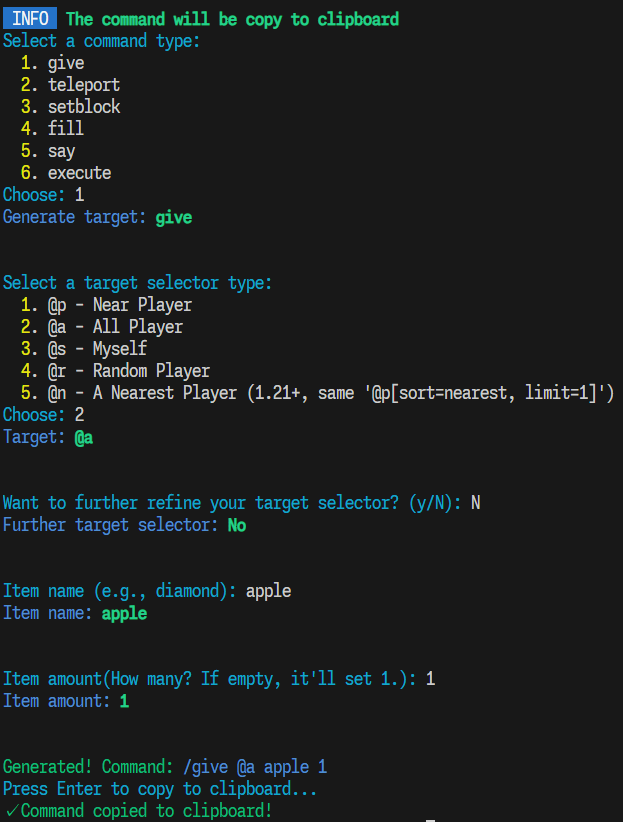

# Minecraft_cmd_CLI

Generate Minecraft Java Edition command on CLI.

---

# Technology Stack

- TypeScript
- Node.js v25.2.0
- Package Manager: pnpm

# Installation

Coming Soon...

# How To Use

Usage:
```
mccmd [options] [command]
```

## options

`-V, --version` Show this CLI Version.
`-h, --help` Show help.

## help

Show help.

Type
```
mccmd -h
```
or
```
mccmd help
```
for help.

## create

Generate Minercaft command interactively.

```
mccmd create [options]
```

### options

`-c, --copy [boolean]` Whether copy command to clipboard.
Default: `true`

### Available Command

`/give, teleport, setblock, fill, say, execute`

Other command is coming soon...

---

# Wiki

See the [Wiki](https://coming-soon.com/ "Coming soon...") for a detailed guide.

# Gallery


